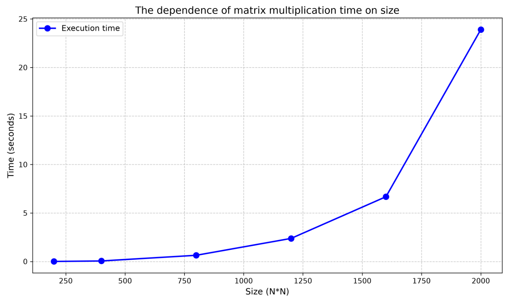

# Лабораторная работа №1

## Тема
Последовательное перемножение матриц

## Описание
Реализация алгоритма умножения квадратных матриц C = A × B с замером времени выполнения и подсчётом количества операций.

## Файлы

| Файл | Описание |
|------|----------|
| `main.cpp` | Исходный код на C++ |
| `verify.py` | Скрипт проверки через NumPy |

## Сборка и запуск

```bash
g++ -O2 main.cpp -o matrix
./matrix

## График зависимости времени от размера


